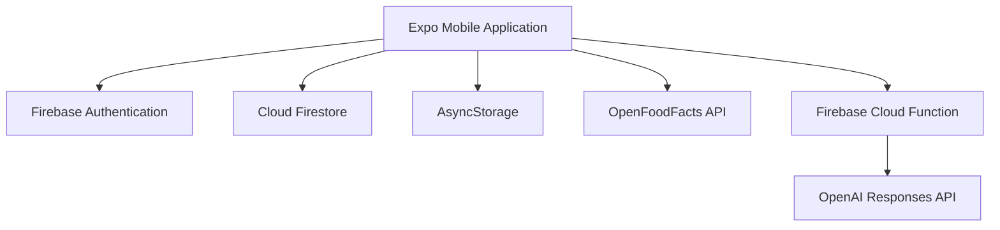
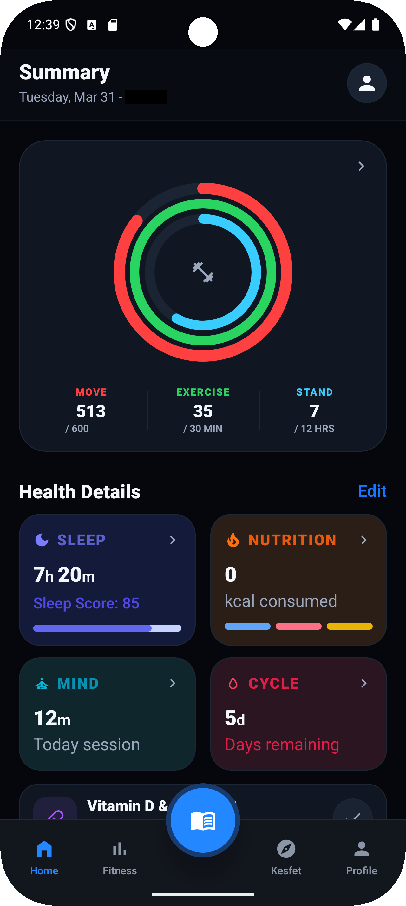
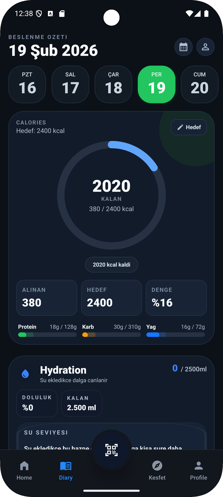
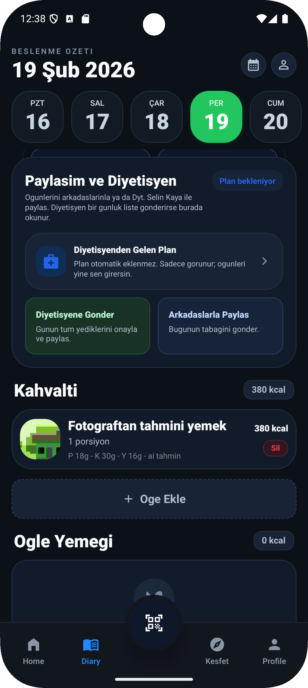
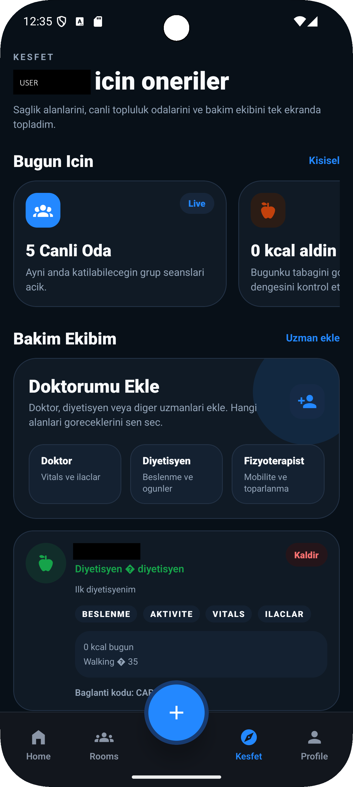
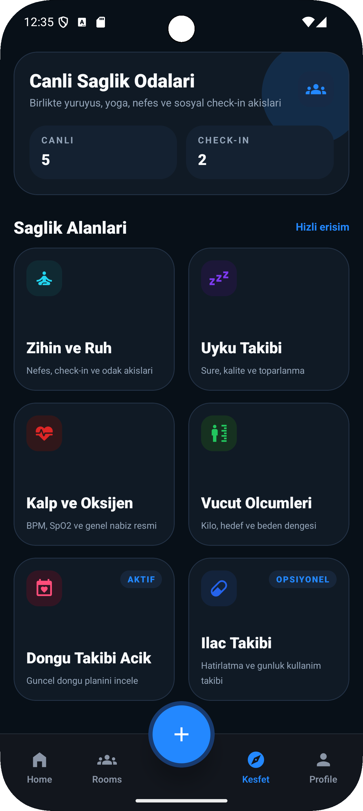
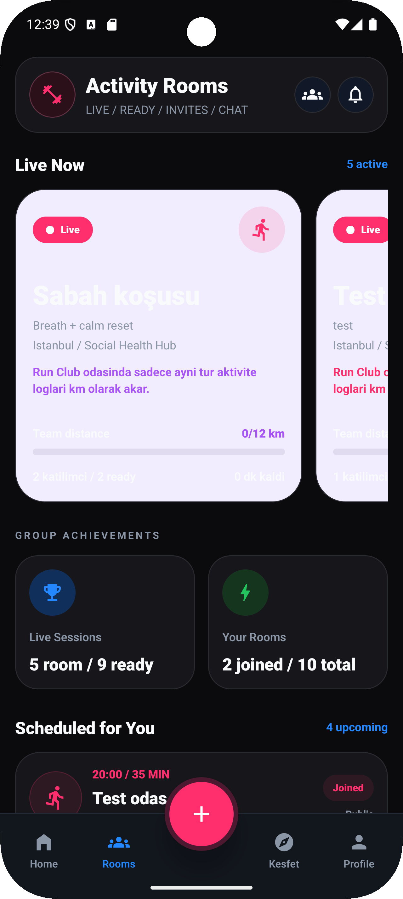
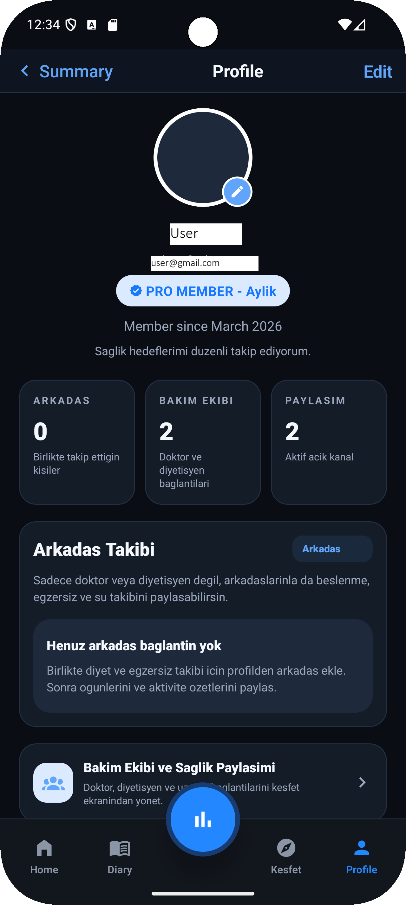
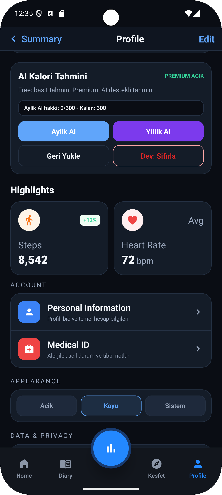

# Mobile Health Hub

A comprehensive mobile health and wellness application developed with Expo, React Native and TypeScript.

The application brings nutrition tracking, activity monitoring, health management and social sports features together in a single mobile experience.

> The complete source code is maintained in a private repository to protect intellectual property and security-sensitive implementation details.

## Overview

Mobile Health Hub was designed to help users manage their daily wellness activities from one application.

The project includes authentication, nutrition tracking, activity management, social sports rooms, profile and privacy management, and AI-assisted nutrition estimation.

## Key Features

- User registration, login and onboarding
- Personalized home dashboard
- Daily nutrition diary
- Food and barcode search
- Activity and exercise tracking
- Social sports rooms
- Health-focused management modules
- Profile and privacy settings
- Care team management
- AI-assisted photo nutrition estimation
- Local data persistence
- Responsive mobile interface

## Technology Stack

### Mobile

- Expo SDK 54
- React Native
- React 19
- TypeScript
- Expo Router
- NativeWind

### Backend and Services

- Firebase Authentication
- Cloud Firestore
- Firebase Cloud Functions
- AsyncStorage
- OpenFoodFacts API
- OpenAI Responses API

### Development Tools

- npm
- EAS Build
- ESLint
- TypeScript
- Git
- GitHub

## Application Architecture

The OpenAI API key is never stored inside the mobile application. AI-powered nutrition requests are processed through an authenticated Firebase Cloud Function.

## Main Modules

### Nutrition Tracking

Users can record meals, browse food information and organize their daily nutrition diary.

### Activity Tracking

The application provides modules for recording and reviewing physical activities.

### Social Sports Rooms

Users can discover and participate in sport-focused social rooms.

### Health Hub

The health section combines multiple wellness and personal health management features.

### AI-Assisted Nutrition Analysis

Users can submit a food image for nutrition estimation. Requests are securely processed through a backend endpoint rather than directly from the mobile client.
## Screenshots

  
  
  

  
  
  

  
  

## My Contributions

I independently worked on:

- Mobile interface development
- Navigation and screen architecture
- Firebase Authentication integration
- Firestore data operations
- Nutrition and activity modules
- OpenFoodFacts integration
- AI-assisted nutrition workflow
- Secure Firebase Cloud Functions architecture
- Environment variable and secret management
- TypeScript validation and lint configuration
- Git and repository preparation

## Security and Privacy

The project follows several security practices:

- OpenAI credentials are stored only on the backend
- Firebase ID tokens are verified by the backend
- Sensitive environment files are excluded from Git
- Personal user information is not included in this repository
- Screenshots are sanitized before publication
- Full source code remains private

## Project Status

The main mobile application and core modules have been developed.

Some cloud-backed features require environment configuration and backend deployment before they can be used in a production environment.

## Source Code

The complete source code is stored in a private repository.

Code access or a technical walkthrough can be provided during an interview when appropriate.

## Developer

**Raşit Yıldırım**  
Computer Engineer — Full Stack & AI Developer

- GitHub: [rasityldrm](https://github.com/rasityldrm)
- LinkedIn: [Raşit Yıldırım](https://www.linkedin.com/in/rasityldrm/)
